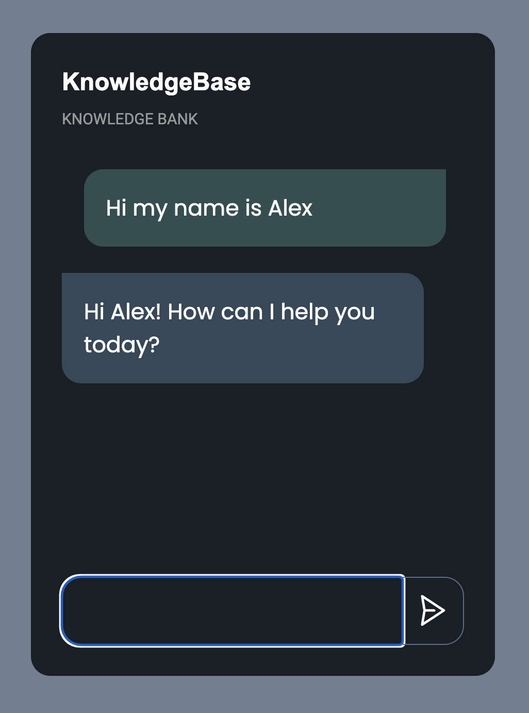
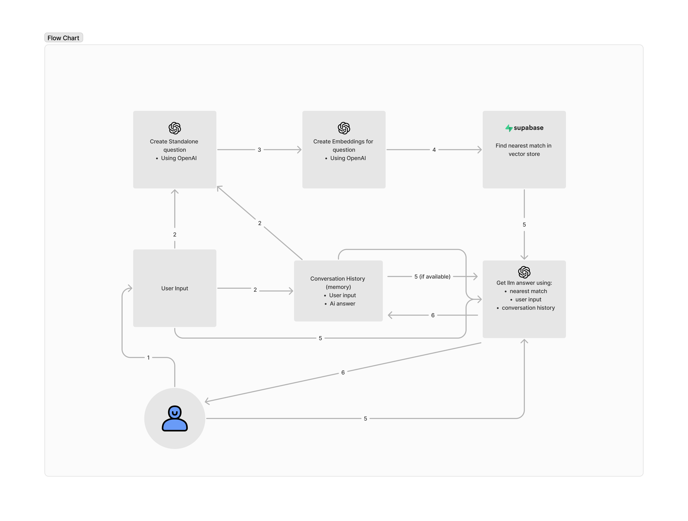

AI Knowledge Base Chat

A simple app that leverages RAG (Retrieval-Augmented Generation) technique for enhancing the accuracy and reliability of the gen AI model with information fetched from a vector database.

- Written in JS, HTML & CSS and Langchain framework
- Supabase as vector db using pgvector extension
- Mockup Inspired by Online Course

To run the app you need:

- OpenAI API Key
- Supabase API Key
- Supabase vector db URL

---

Mockup


---

Flow Chart

1. The user presses send, and we gather their input.
2. Save User Input: We save the user input to our conversation history as “Human”.

- From the user input, we create a standalone question, which is a concise version of the query reduced to the minimum number of words needed to express the request for information.
- If previous conversation history is available, it is used to provide extra context for creating the standalone question.

3. We create embeddings for the standalone question using OpenAI.
4. We retrieve the nearest match to the standalone question in our vector database (using Supabase).
5. The LLM is fed with the original user input for additional context, the relevant context found in our vector database, and, if available, our conversation history.
6. The LLM generates an answer based on the provided contexts.

- The generated answer is sent back to the user, and this answer is saved to the conversation history as “AI”.



---

Project setup

Intall all dependencies

```
npm install
```

Vector DB setup

1. You need to setup the db you need to create an account with supabase
2. Once you create a Database, run the file matchDocuments.sql in the sql query editor, this will:

- Enable the pgvector extension to work with embedding vectors (can also be done manually)
- Create a table to store your documents
- Create a function to search for documents

3. Add Supabase url and API key to .env file with same name corresponding to the variables in config.js

Create and store Embeddings

1. Use function storeText(text) in splitAndStore.js to:

- Split the text in chunk, default chunck size 500 and a chunck overlap of 50 (10%)
- Use OpenAIEmbeddings() vector of size 1536 dimensions
- Store embeddings in supabase vector db

To run the project with Parcel

```
npm start
```
